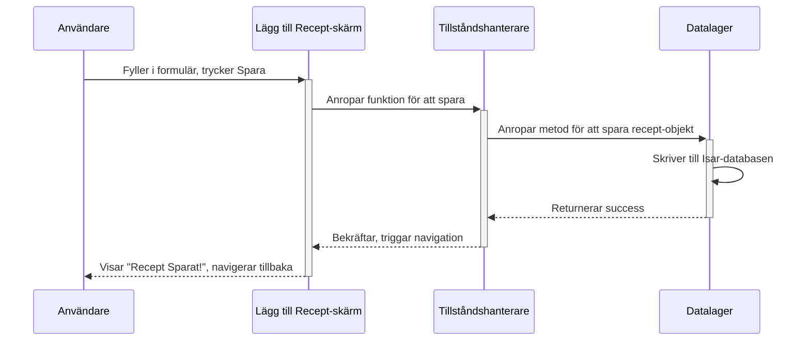

Familiens Receptbok Architecture Document

## Introduction

[cite\_start]Detta dokument beskriver den kompletta fullstack-arkitekturen för Familiens Receptbok, inklusive backend-system, frontend-implementering och deras integration[cite: 721]. [cite\_start]Det fungerar som den enda källan till sanning för AI-driven utveckling, vilket säkerställer konsistens över hela teknikstacken[cite: 721]. [cite\_start]Detta enhetliga tillvägagångssätt kombinerar vad som traditionellt skulle vara separata backend- och frontend-arkitekturdokument, vilket effektiviserar utvecklingsprocessen för moderna fullstack-applikationer där dessa områden blir alltmer sammanflätade[cite: 722].

### Starter Template or Existing Project

[cite\_start]Projektet kommer att baseras på **"Very Good Core"**-mallen från Very Good Ventures[cite: 723]. [cite\_start]Detta ger en beprövad och skalbar projektstruktur, förkonfigurerade verktyg för kodkvalitet och en solid grund för testning[cite: 604].

### Change Log

| Date | Version | Description | Author |
| :--- | :------ | :---------- | :----- |
| 2025-07-09 | 1.0 | Initial draft created | Winston, Architect |

## High Level Architecture

### Technical Summary

[cite\_start]Applikationen kommer att byggas som en "local-first" Flutter-applikation baserad på "Very Good Core"-mallen[cite: 609]. [cite\_start]Arkitekturen separerar tydligt presentationslagret (UI) från affärslogik och datalagring[cite: 609]. [cite\_start]Kärnan består av ett lokalt datalager (Isar) som hanteras via ett "Repository Pattern" för att hålla koden ren och testbar[cite: 609]. [cite\_start]Appens tillstånd hanteras med Riverpod[cite: 609]. [cite\_start]Den mest utmärkande funktionen, synkronisering, kommer att ske direkt mellan enheter över ett lokalt nätverk[cite: 609].

### Platform and Infrastructure Choice

  * [cite\_start]**Platform**: Ingen molnplattform (Local-First)[cite: 727]. Applikationen är helt fristående på användarens enheter.
  * **Deployment Target**: Apple App Store och Google Play Store.

### Repository Structure

  * **Structure**: Monorepo. [cite\_start]Detta val, som redan nämnts i PRD, bekräftas[cite: 729]. Det passar utmärkt med "Very Good Core"-mallen och håller all kod och konfiguration samlad på ett ställe.

### High Level Architecture Diagram

```mermaid
graph TD
    subgraph Device 1
        direction LR
        A1[UI Layer (Widgets)] <--> B1[State Management (Riverpod)]
        B1 <--> C1[Business Logic (Services)]
        C1 <--> D1[Data Layer (Repositories)]
        D1 <--> E1[(Local DB: Isar/Hive)]
        C1 <--> F1[Sync Module]
    end

    subgraph Device 2
        direction LR
        A2[UI Layer (Widgets)] <--> B2[State Management (Riverpod)]
        B2 <--> C2[Business Logic (Services)]
        C2 <--> D2[Data Layer (Repositories)]
        D2 <--> E2[(Local DB: Isar/Hive)]
        C2 <--> F2[Sync Module]
    end

    F1 <-->|Local Wi-Fi| F2
```

### Architectural and Design Patterns

  * **Local-First Architecture**: Appen måste fungera fullt ut offline. [cite\_start]Detta är ett kärnkrav från PRD för att säkerställa integritet[cite: 730].
  * **Repository Pattern**: Vi separerar datakällan från resten av appen. [cite\_start]Detta förenklar testning och eventuella framtida databasbyten[cite: 730, 613].
  * [cite\_start]**State Management (Riverpod/Provider)**: Vi använder en etablerad lösning för att hantera appens tillstånd, vilket är standardpraxis i Flutter[cite: 730].
  * [cite\_start]**Service Discovery (t.ex. Bonjour/NSD)**: För att enheterna ska kunna hitta varandra på ett lokalt nätverk utan manuell konfiguration[cite: 612].

## Tech Stack

[cite\_start]Detta är den definitiva listan över teknologier som kommer att användas i projektet[cite: 732].

| Category | Technology | Version | Purpose | Rationale |
| :--- | :--- | :--- | :--- | :--- |
| **Language** | Dart | \~3.4.0 | [cite\_start]Primärt utvecklingsspråk [cite: 737, 621] | Krävs för Flutter; modern, null-säker och snabb. |
| **Framework** | Flutter | \~3.22.0 | [cite\_start]Ramverk för UI och app-logik [cite: 738, 624] | Användarens kärnkrav; möjliggör en enda kodbas för iOS & Android. |
| **UI Component Library** | Material 3 | (via Flutter) | [cite\_start]Grundläggande UI-komponenter [cite: 739] | Flutters inbyggda, moderna och flexibla designsystem. |
| **State Management** | Riverpod | \~2.5.0 | [cite\_start]Hantera och dela appens tillstånd [cite: 740, 687] | Kraftfullt, testbart och rekommenderat av VGV-mallen. |
| **Database** | **Isar Database** | \~3.1.0 | [cite\_start]Snabb, lokal databas [cite: 745, 625] | Extremt snabb och byggd för Flutter. Lätt att använda och hanterar relationer väl. |
| **File Storage** | path\_provider | \~2.1.0 | [cite\_start]Hitta korrekta sökvägar på enheten [cite: 748] | Standardpaket för att pålitligt hitta var man ska lagra databasen och bilder. |
| **Local Sync Tech** | nsd\_flutter | \~3.2.0 | Upptäcka enheter på lokalt nätverk | En robust lösning för "Network Service Discovery" (NSD). |
| **Testing (Unit/Widget)**| flutter\_test / mocktail | (via Flutter/VGV)| [cite\_start]Testa enskilda funktioner och widgets [cite: 751] | Standardverktyg i Flutter-ekosystemet och VGV-mallen. |
| **Testing (E2E)** | patrol | \~3.4.0 | [cite\_start]Automatisera UI-tester [cite: 754] | Modernt och kraftfullt verktyg för att testa hela användarflöden. |
| **Logging** | logger | \~2.3.0 | [cite\_start]Hantera och visa loggar under utveckling [cite: 764, 636] | Ett enkelt och populärt paket för tydliga loggmeddelanden. |

## Data Models

[cite\_start]Dessa modeller definierar hur data struktureras i applikationen[cite: 772].

### 1\. Recipe

  * [cite\_start]**Syfte**: Att lagra all information som rör ett enskilt recept[cite: 772].
  * [cite\_start]**Attribut**: `id`, `title`, `ingredients`, `instructions`, `imagePath`, `createdAt`, `updatedAt`[cite: 772].
  * [cite\_start]**Relationer**: Många-till-många med `Category`[cite: 772].
  * **Koddefinition (för Isar)**:
    ```dart
    import 'package:isar/isar.dart';
    import 'category.dart';

    part 'recipe.g.dart';

    @collection
    class Recipe {
      Id id = Isar.autoIncrement;

      @Index(type: IndexType.value)
      String? title;

      String? ingredients;
      String? instructions;
      String? imagePath;

      DateTime? createdAt;
      DateTime? updatedAt;

      final categories = IsarLinks<Category>();
    }
    ```

### 2\. Category

  * [cite\_start]**Syfte**: Att låta användaren gruppera och organisera sina recept[cite: 772].
  * [cite\_start]**Attribut**: `id`, `name`[cite: 772].
  * [cite\_start]**Relationer**: Många-till-många med `Recipe`[cite: 772].
  * **Koddefinition (för Isar)**:
    ```dart
    import 'package:isar/isar.dart';
    import 'recipe.dart';

    part 'category.g.dart';

    @collection
    class Category {
      Id id = Isar.autoIncrement;

      @Index(type: IndexType.value, unique: true)
      String? name;

      @Backlink(to: 'categories')
      final recipes = IsarLinks<Recipe>();
    }
    ```

## REST API Spec

[cite\_start]Denna sektion är inte applicerbar då applikationen är "local-first" och inte använder ett externt webb-API[cite: 777].

## Components

[cite\_start]Applikationens kod är organiserad i följande logiska byggstenar[cite: 778]:

1.  [cite\_start]**Data Layer (Repositories)**: Ansvarar för all kommunikation med den lokala Isar-databasen[cite: 778].
2.  [cite\_start]**Business Logic Layer (Services)**: Innehåller appens "hjärna", inklusive `SyncService` för synkroniseringslogik[cite: 778].
3.  [cite\_start]**UI Layer (Features/Views)**: Allt som användaren ser och interagerar med, organiserat efter funktion (`recipes`, `categories`, etc.)[cite: 778].
4.  [cite\_start]**State Management Layer (Providers)**: Hanterar appens tillstånd med Riverpod och agerar som mellanhand mellan UI och affärslogik[cite: 778].

## Core Workflows

### 1\. Flöde: Lägga till ett nytt recept



### 2\. Flöde: Synkronisering mellan enheter

```mermaid
sequenceDiagram
    participant User1 as Användare (Enhet 1)
    participant App1 as App (Enhet 1)
    participant App2 as App (Enhet 2)
    participant User2 as Användare (Enhet 2)

    User1->>App1: Startar synkronisering
    App1->>App1: Upptäcker enheter i nätverket
    App1-->>App2: Skickar anslutningsförfrågan
    App2-->>User2: Visar "Tillåt synk från Enhet 1?"
    User2->>App2: Godkänner förfrågan
    App2-->>App1: Skickar godkännande
    Note over App1, App2: Enheterna utbyter listor över recept (ID + tidsstämpel)
    Note over App1, App2: Enheterna begär saknad/nyare data
    App1<->>App2: Överför receptdata
    App1->>App1: Uppdaterar lokal databas
    App2->>App2: Uppdaterar lokal databas
    App1-->>User1: Visar "Synkronisering klar"
    App2-->>User2: Visar "Synkronisering klar"
```

## Database Schema

[cite\_start]Den konkreta schemadefinitionen är direkt representerad av Dart-klasserna (`Recipe`, `Category`) med Isar-annoteringar i sektionen "Data Models"[cite: 782, 647].

## Unified Project Structure

[cite\_start]Projektet kommer följa en struktur som rekommenderas av "Very Good Core"-mallen[cite: 794, 648]:

```plaintext
familiens_receptbok/
├── lib/                  # Application source code
│   ├── app/              # App setup, routing, themes
│   ├── data/             # Data Layer (Repositories, Models)
│   ├── domain/           # Business Logic Layer (Services)
│   ├── features/         # UI Layer (organized by feature)
│   └── l10n/             # Localization files
├── test/                 # All test files
├── pubspec.yaml          # Project dependencies
└── README.md
```

## Development Workflow

[cite\_start]Utvecklingsprocessen följer standardpraxis för Flutter[cite: 803]:

  * **Hämta beroenden**: `flutter pub get`
  * **Starta appen**: `flutter run`
  * **Kör tester**: `flutter test`

## Coding Standards

[cite\_start]Vi kommer att följa de strikta reglerna som definieras av **`very_good_analysis`**-paketet för att säkerställa hög kodkvalitet[cite: 817, 656].

  * [cite\_start]**Kritisk regel**: All databaskommunikation måste ske via `Repository`-lagret[cite: 817, 663].
  * [cite\_start]**Kritisk regel**: Appens tillstånd ska hanteras via `Riverpod`-providers[cite: 817, 663].

## Error Handling Strategy

[cite\_start]En lagerindelad strategi kommer att användas[cite: 829, 655]:

1.  **Datalagret** fångar och "översätter" databasfel.
2.  **Affärslogiklagret** hanterar dessa fel.
3.  **UI-lagret** visar användarvänliga meddelanden istället för tekniska fel.